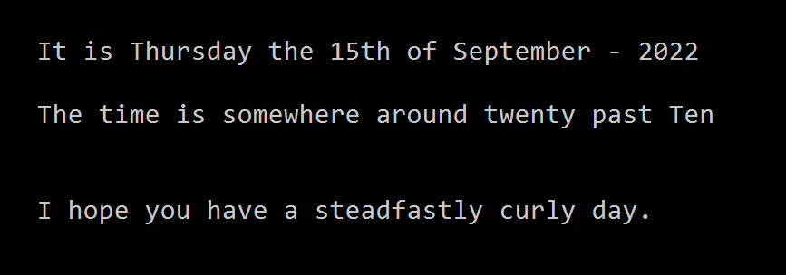
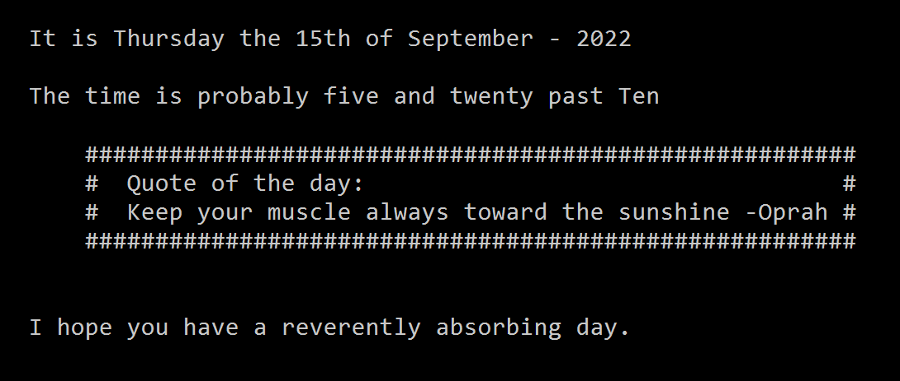
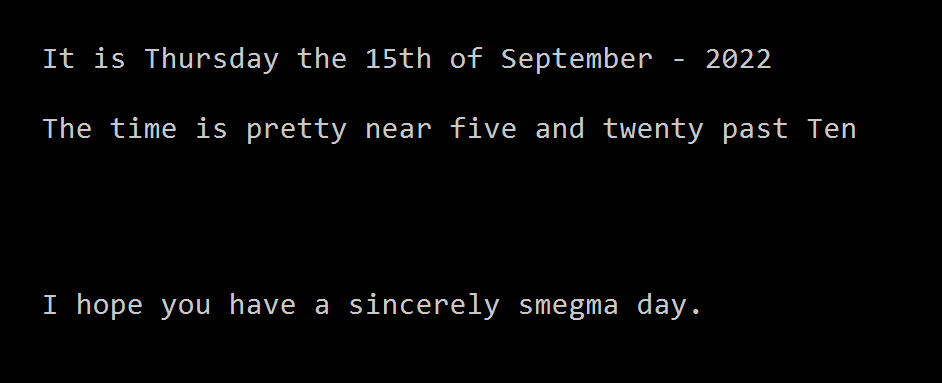

# Psychosapien's Rubbish Wallpaper Module

This Powershell Module is designed to replace the current wallpaper with a randomly generated one. The generated wallpaper displays the time, along with a few other bits if you would like it to.

The package can be found on the gallery [here]()

## General Use

The module is available from the PS Gallery and can be installed with the following command:

```powershell
Install-Module -Name Set-WallpaperClock
```

To run the module, you need to be in an elevated shell. For simple use, just run:

```powershell
Set-WallpaperClock
```

This will set a wallpaper that looks a bit like this



For a bit of a more fun wallpaper, add the -withQuote switch:



Lastly, You can make it rude simply by throwin in the -Sweary switch:



## The really cool bit

This function can integrate with Azure DevOps (ADO) and present your outstanding work items also.

To get this working, please follow these steps:

- The first thing you need for this is a [PAT token](https://docs.microsoft.com/en-us/azure/devops/organizations/accounts/use-personal-access-tokens-to-authenticate?view=azure-devops&tabs=Windows) for the project you wish to report on.
- Run New-ADOCredential with the following parameters
  - **patToken**
    - This should be the token you created for ADO
  - **organizationName**
    - The name of your DevOps Org
  - **projectName**
    - The name of the project you want to get items from
  - **userFullName**
    - This should be your full name as it appears in ADO
  - **userPrincipalName**
    - Your email address a registered in ADO

Once you have run this command, a credentials file is created that will be used for getting info from ADO.

It will present you  a desktop that looks a little like this (this is run with all switches):


When your PAT token expires, simply run Update-ADOPATToken with the new token specified for the -patToken parameter.
